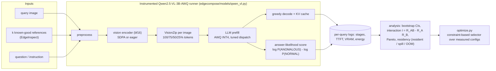
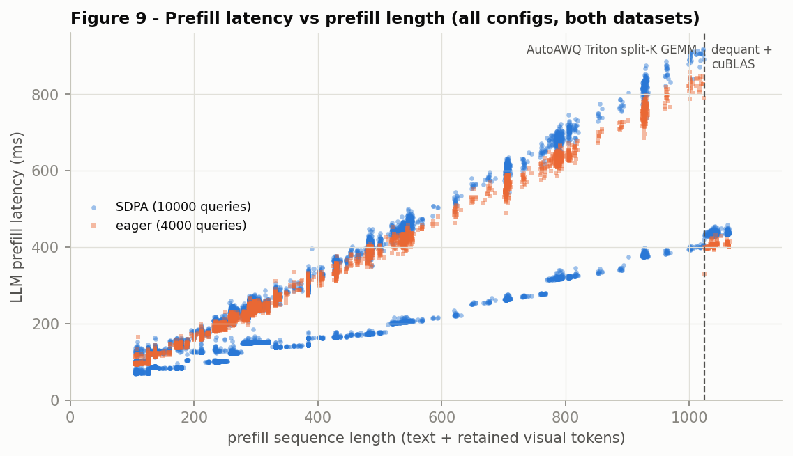
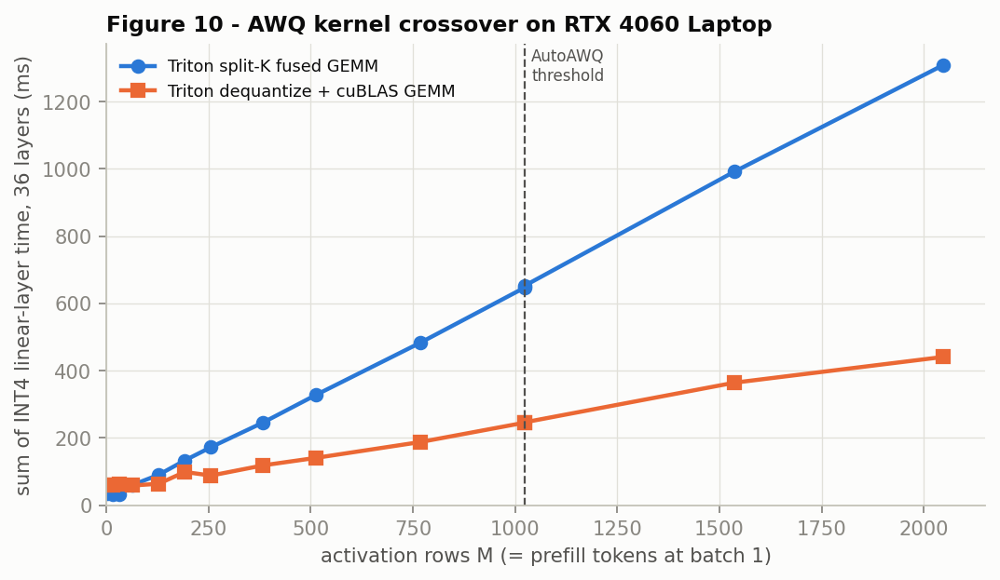
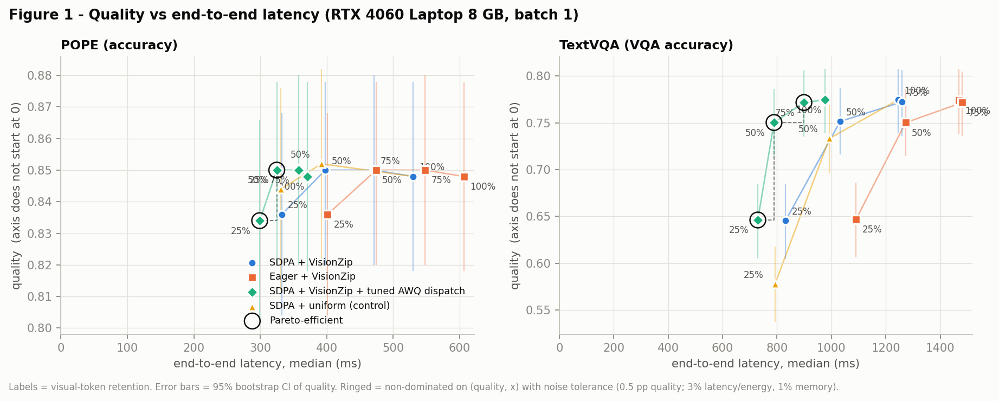
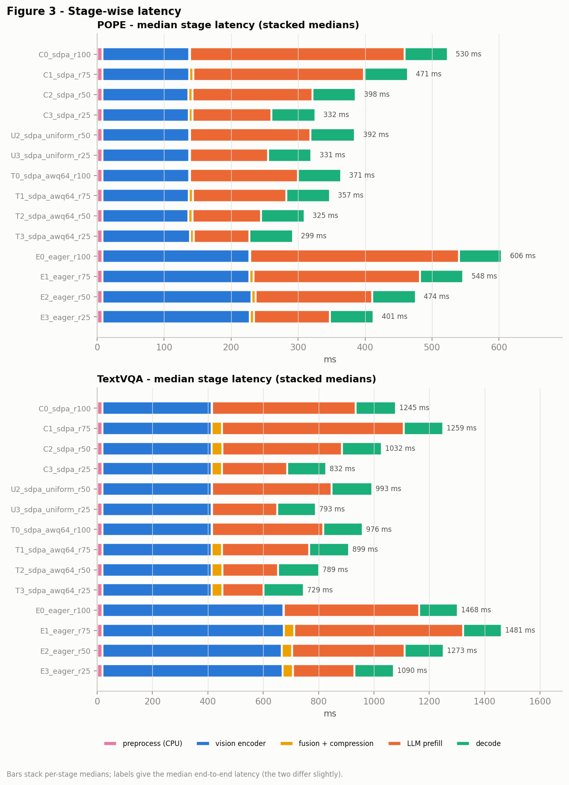
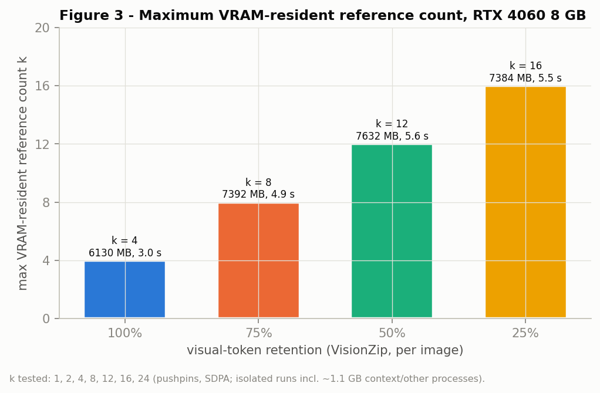
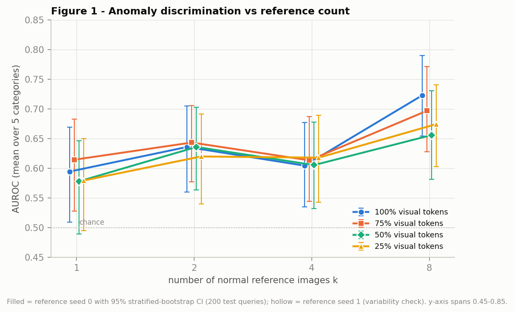
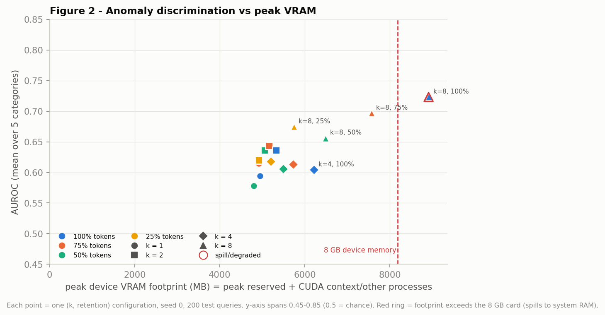
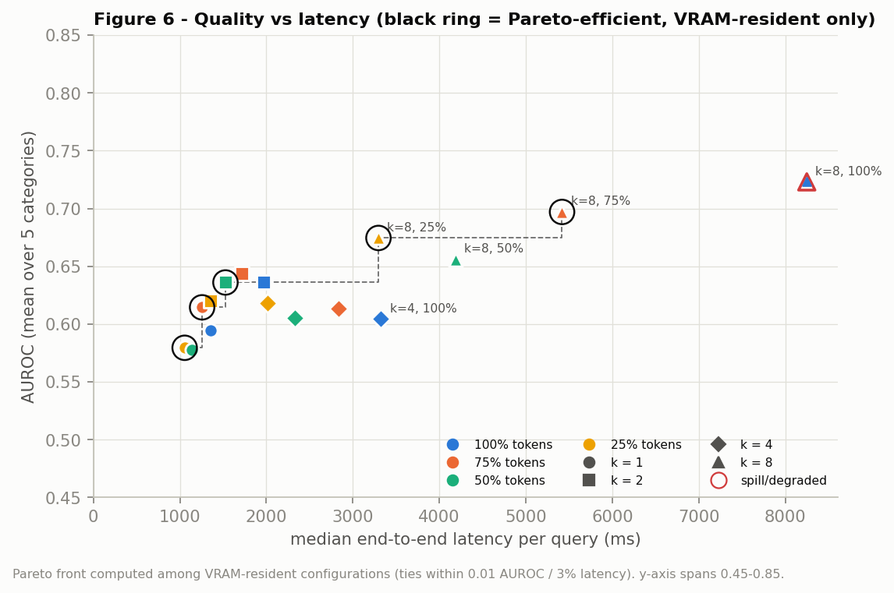

# EdgeCompose-VLM + EdgeInspect-VLM

**A hardware-aware study of efficient multimodal foundation-model inference on an RTX 4060 8 GB
GPU, extended to few-shot industrial anomaly inspection where visual-token compression increases
the usable reference context under a strict memory budget.**

Model: `Qwen/Qwen2.5-VL-3B-Instruct-AWQ` (INT4) · GPU: RTX 4060 Laptop, 8 GB · batch 1 · no training.
This is a systems study and deployment framework, not a new compression or quantization algorithm:
AWQ, VisionZip, SDPA and FlashAttention are prior work (see [References](#references)).

## Key results (all measured in this repository)

| | Result |
|---|---|
| **Composition** | SDPA speeds up the *vision encoder* (−40%), VisionZip shortens *prefill*; their savings add. |
| **Kernel-dispatch interaction** | AutoAWQ's fixed 1024-token GEMM switch made 75%-token VisionZip **17% slower** in TTFT on TextVQA; re-tuning the threshold to the measured crossover + VisionZip 75% → **−27.8% latency at 99.6% of TextVQA accuracy, −27% GPU energy** (POPE, VisionZip 50%: −38.7% latency, 100.2% accuracy). |
| **Bottleneck shift** | After pruning, the vision encoder dominates (37% → 53% of latency); decode ≈64 ms/token everywhere. |
| **Numerical failure found & fixed** | fp16 overflow in the last ViT block broke 3.2% of TextVQA answers; bf16 vision tower → 16 failures to 0. |
| **Reference capacity on 8 GB** | Max VRAM-resident known-good references: **4 at 100% tokens → 8 / 12 / 16 at 75 / 50 / 25%**. |
| **Capacity → quality** | 1 → 8 references: **+0.08 to +0.13 AUROC** at every retention (paired CIs exclude 0); best VRAM-resident config (k = 8, 75%) **0.697 AUROC vs 0.605** for the best uncompressed config that fits (k = 4): **+0.092 [+0.026, +0.170]**. |
| **Honest limits** | Absolute inspection quality is modest (mean AUROC ≤ 0.72; pushpins ≈ chance); the VLM's own NORMAL/ANOMALOUS answer is ~98% "ANOMALOUS" and unusable without likelihood scoring + normal-only calibration. |

⟨EI:readme-seed-row⟩

## Why it matters

Efficient deployment is usually argued from model size and FLOPs. On real constrained hardware
the outcome was decided by interactions: token pruning vs. the quantization library's kernel
choice, fp16 range vs. the vision tower's activations, caching-allocator growth vs. VRAM, and
silent system-memory spill vs. latency. Understanding those interactions turned a slower
configuration into a 28% faster one, and — for inspection — turned an 8 GB limit of 4 reference
images into 8-16, which measurably improves few-shot anomaly discrimination.

## Architecture



## EdgeCompose findings (single-image VQA, 14 configs x 500 TextVQA + 500 POPE = 14,000 queries)

| TextVQA config | Accuracy* | TTFT | E2E | Peak alloc | Energy |
|---|---|---|---|---|---|
| C0 AWQ, SDPA, 100% tokens (baseline) | 0.800 | 957 ms | 1245 ms | 3507 MB | 92.4 J |
| C1 + VisionZip 75% (upstream AWQ dispatch) | 0.798 | **1119 ms (+17%)** | 1259 ms | 3446 MB | 96.2 J |
| T0 tuned dispatch, 100% | 0.800 | 843 ms | 976 ms (−21.6%) | 3507 MB | 73.5 J |
| **T1 tuned dispatch + VisionZip 75%** | **0.797** | 765 ms | **899 ms (−27.8%)** | 3446 MB | 67.6 J |
| T2 tuned dispatch + VisionZip 50% | 0.775 | 655 ms | 789 ms (−36.6%) | 3446 MB | 58.6 J |
| E0 eager attention, 100% | 0.800 | 1313 ms | 1468 ms (+17.9%) | 5216 MB (+1.7 GB) | 102.4 J |

\*Accuracy on the 484 samples without the (since fixed) fp16 overflow; see the erratum in the report.

* **Composition is stage-dependent:** SDPA × VisionZip ≈ additive (disjoint stages); tuned dispatch ×
  VisionZip interacts (synergy on TextVQA, interference on POPE) — individually measured gains do not
  predict composed gains in general.
* **Cause of the slowdown:** AutoAWQ runs a fused Triton W4A16 GEMM below 1024 rows and dequantize +
  cuBLAS above; on this GPU the fused kernel is 2.6x slower at ~1000 rows and only wins ≤ 32 rows
  (decode). Pruning moved prompts below the switch.
* **Quality:** VisionZip keeps 99.7 / 97.0 / 83.3% of TextVQA accuracy at 75 / 50 / 25% tokens; POPE is
  unchanged within noise; VisionZip beats uniform subsampling by +2.5 pp (50%) and +8.1 pp (25%).
* Pareto front (quality, latency, memory): tuned dispatch + VisionZip only. Details:
  [report/edgecompose_report.md](report/edgecompose_report.md).

## EdgeInspect use case (few-shot inspection on MVTec LOCO AD)

k normal references + 1 query → NORMAL/ANOMALOUS. 5 categories (breakfast box, juice bottle,
pushpins, screw bag, splicing connectors) with structural and logical anomalies; k ∈ {1,2,4,8} x
retention ∈ {100,75,50,25}%; 200 test queries per configuration (+ 10 normal validation images per
category for a normal-only decision threshold); AUROC as the primary metric.

| k | retention | mean AUROC [95% CI] | F1 @ normal-only threshold | E2E latency | VRAM footprint | residency |
|---|---|---|---|---|---|---|
| 1 | 100% | 0.594 [0.511, 0.670] | 0.357 | 1.35 s | 4.9 GB | resident |
| 4 | 100% | 0.605 [0.522, 0.686] | 0.323 | 3.33 s | 6.2 GB | resident (max k at 100%) |
| 8 | 100% | 0.723 [0.647, 0.793] | 0.586 | 8.25 s | 8.9 GB | **spills to system RAM** |
| **8** | **75%** | **0.697 [0.624, 0.769]** | 0.583 | 5.42 s | 7.6 GB | resident |
| 8 | 25% | 0.674 [0.601, 0.743] | 0.487 | 3.30 s | 5.7 GB | resident |

* More references help (k = 1 → 8: +0.08 to +0.13 AUROC at every retention); compression at a fixed
  k ≤ 4 has no detectable quality cost; 75% retention is free even at k = 8 (−0.026, n.s.).
* Structural and logical anomalies behave alike (e.g. 0.697 vs 0.697 at k = 8 / 75%).
* Categories differ: breakfast box up to 0.87, splicing connectors 0.77-0.85 at k = 8, pushpins ≈ chance.
* Details, CIs, per-category and structural/logical tables: [report/edgeinspect_report.md](report/edgeinspect_report.md).

## Hardware

NVIDIA GeForce RTX 4060 Laptop GPU (8188 MB, sm_89, 115 W), 15.7 GB RAM, Windows 11 (WDDM);
Python 3.9, PyTorch 2.7.1+cu118, Transformers 4.57.1, AutoAWQ 0.2.9 + triton-windows 3.3.1.
SDPA uses the memory-efficient kernel (this build has no FlashAttention kernel; flash-attn was not
installable). About 1.1 GB of VRAM is used by the CUDA context and other applications.
Exact environment: `requirements-lock.txt`, `results/system_info.json`.

## Reproduction

```powershell
# environment (torch first, from the CUDA index; AutoAWQ without deps so torch is not replaced)
pip install torch==2.7.1 torchvision==0.22.1 --index-url https://download.pytorch.org/whl/cu118
pip install transformers==4.57.1 accelerate==1.10.1 huggingface-hub hf_xet pyarrow pandas pillow pyyaml matplotlib nvidia-ml-py pytest
pip install --no-deps autoawq==0.2.9 zstandard triton-windows==3.3.1.post21
python scripts/system_check.py && python -m pytest tests -q          # 45 unit tests

# EdgeCompose (VQA)
python scripts/download_assets.py --repo Qwen/Qwen2.5-VL-3B-Instruct-AWQ
python scripts/prepare_data.py --n 200 1000
python scripts/smoke_test.py
python scripts/awq_kernel_bench.py
python scripts/run_sweep.py --sweep sweep_final.yaml --n 1000 --limit 500   # 14 configs, ~4.5 h (reported run: --vision-dtype float16, see erratum)
python scripts/analyze.py --n 500 --main

# EdgeInspect (MVTec LOCO AD; download the archive from MVTec, CC BY-NC-SA 4.0)
python scripts/prepare_loco.py --final-per-label 20 10 10
python scripts/run_edgeinspect_sweep.py --steps memory grid seeds memory_eager    # ~6 h
python scripts/analyze_edgeinspect.py --tag final --main
python scripts/edgeinspect_examples.py

# deployment optimizer over measured results
python scripts/optimize.py --objective latency --min-quality 0.97 --relative-quality
python scripts/optimize.py --task industrial_inspection --max-vram-mb 7000 --max-latency-ms 6000 --min-auroc 0.65
```

Runs are resumable, every query is logged (`results/raw/`, `results/edgeinspect/raw/`), and the final
EdgeInspect grid is archived read-only with SHA-256 checksums. `PROJECT_STATUS.md` records every
decision, workaround and failed approach.

## Demo

⟨EI:readme-demo⟩

## Main figures

| | |
|---|---|
|  **AWQ dispatch cliff** — prefill time drops at 1024 tokens |  **Kernel crossover** — fused GEMM wins only ≤ 32 rows |
|  **EdgeCompose quality vs latency** (Pareto ringed) |  **Stage-wise latency** — vision encoder becomes the bottleneck |
|  **Reference capacity** vs token retention (8 GB) |  **Inspection AUROC vs number of references** |
|  **AUROC vs VRAM** — compression moves the feasible region |  **AUROC vs latency** (resident Pareto front) |

All figures: `plots/` (EdgeCompose, 10) and `plots/edgeinspect/` (EdgeInspect, 6 + examples).

## Limitations

* One GPU (Windows laptop) and one model family (Qwen2.5-VL-3B-AWQ); absolute latencies drift
  12-32% between sessions (within-session comparisons are interleaved and paired).
* FlashAttention-2 not evaluated; SDPA = memory-efficient kernel.
* Samples: 500 per VQA dataset; 200 inspection queries per configuration, one full + one partial
  reference seed; per-category inspection results are noisy.
* EdgeInspect uses a fixed, untuned prompt and ≤ 512 visual tokens per image; the VLM's answers are
  biased and its likelihood score is uncalibrated (threshold from 10 normal images); no localization;
  no factory data; MVTec LOCO AD is CC BY-NC-SA 4.0 and is not redistributed.
* The reported EdgeCompose sweep ran the vision tower in fp16 (3.2% TextVQA overflow); corrected
  numbers are given on overflow-free samples, not from a full re-run.

## Reports

* [report/edgecompose_report.md](report/edgecompose_report.md) — EdgeCompose-VLM research report (methods, results, RQ1-RQ5, erratum).
* [report/edgeinspect_report.md](report/edgeinspect_report.md) — EdgeInspect-VLM research report (RQ1-RQ6, systems findings).
* [report/one_page_summary.md](report/one_page_summary.md) · [report/interview_prep.md](report/interview_prep.md) · [report/merl_application.md](report/merl_application.md)

## References

* Qwen2.5-VL (Bai et al., 2025); checkpoint `Qwen/Qwen2.5-VL-3B-Instruct-AWQ`.
* AWQ (Lin et al., MLSys 2024); AutoAWQ (archived) with triton-windows kernels.
* VisionZip (Yang et al., CVPR 2025; github.com/dvlab-research/VisionZip, Qwen2.5-VL code).
* FlashAttention (Dao et al.); PyTorch `scaled_dot_product_attention`.
* TextVQA (Singh et al., CVPR 2019); POPE (Li et al., EMNLP 2023) — lmms-lab releases.
* MVTec LOCO AD (Bergmann et al., IJCV 2022), CC BY-NC-SA 4.0.
