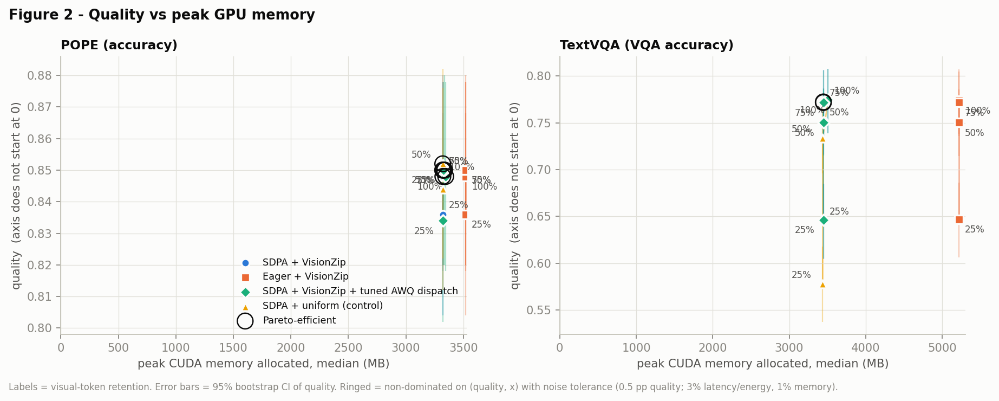
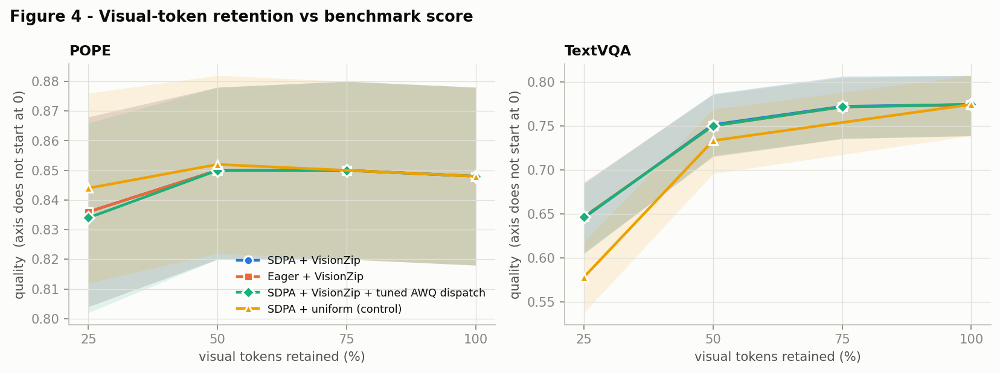
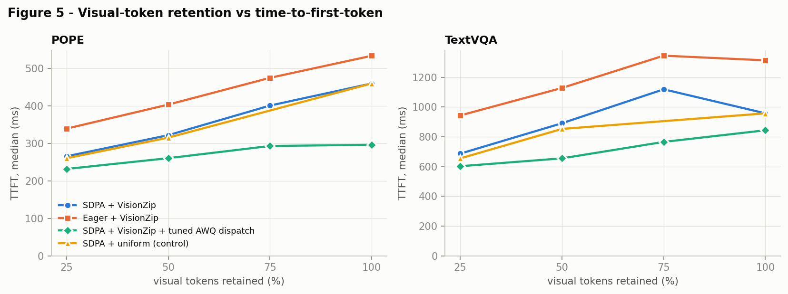
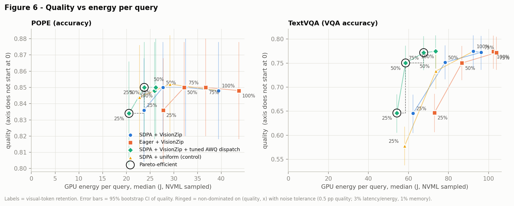
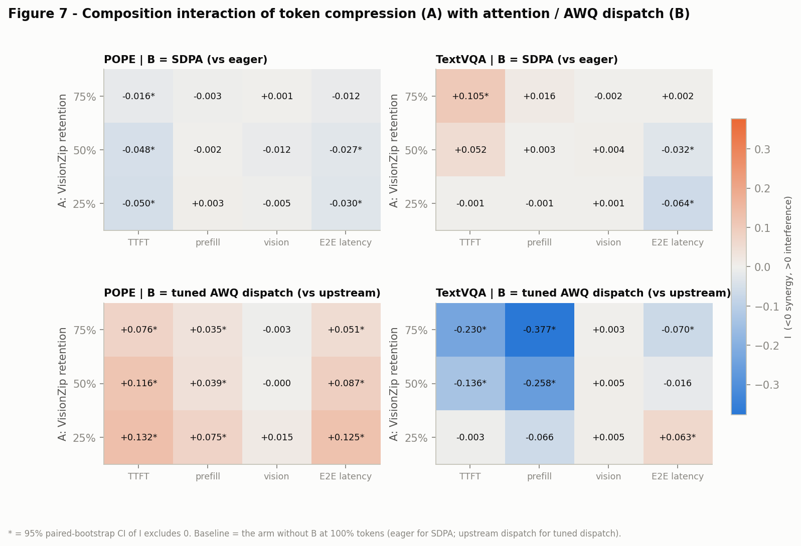
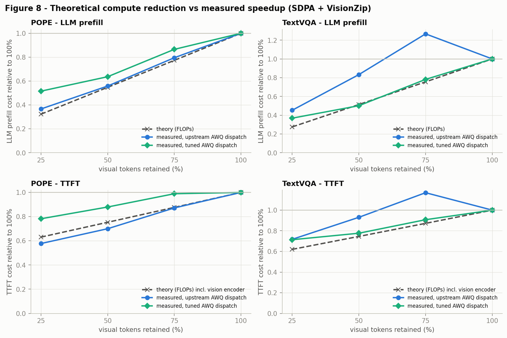
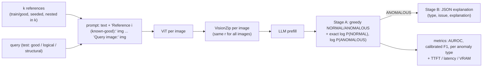

# EdgeCompose-VLM

**Understanding compositional efficiency for vision-language models on resource-constrained GPUs**

EdgeCompose-VLM is a reproducible evaluation and deployment framework for studying how
**low-bit weight quantization (AWQ INT4)**, **visual-token compression (VisionZip)** and
**optimized attention (PyTorch SDPA vs. eager)** interact when composed for single-image,
batch-1 VLM inference on a consumer **RTX 4060 Laptop GPU (8 GB)**. It is a
*systems study*, not a new compression algorithm: every technique used here is prior work
(see [References](#references)); the contribution is the unified, instrumented
implementation, stage-wise profiling, composition/interaction analysis, Pareto analysis
and a measured-data deployment optimizer. A second part, **[EdgeInspect-VLM](#edgeinspect-vlm)**,
applies the stack to few-shot industrial inspection on MVTec LOCO AD.

**In one minute (measured, 500 TextVQA + 500 POPE questions, 14 configs, 14,000 queries):**

* **Compression composes with attention additively, but interacts with the quantization
  kernels.** SDPA speeds up the *vision encoder* (−40%), VisionZip shortens *prefill*; their
  savings add. AutoAWQ's hard-coded kernel threshold (M ≥ 1024 → dequant+cuBLAS) made
  75%-token VisionZip **17% slower in TTFT** on TextVQA; re-tuning the threshold to the
  measured crossover (M = 64) turned the same pruning into a **27.8% end-to-end speedup at
  99.6% of baseline accuracy** (and −27% energy).
* **Quality:** TextVQA keeps 99.7 / 97.0 / 83.3% of accuracy at 75 / 50 / 25% visual tokens;
  POPE is unchanged within noise. VisionZip beats uniform subsampling on TextVQA (+2.5 pp at
  50%, +8.1 pp at 25%, overflow-free samples).
* **Erratum (found and fixed):** with an fp16 vision tower, 3.2% of TextVQA images overflow in
  the last ViT block and produce `!!!!` in every config; the vision tower now runs in bf16
  (validated: 16 → 0 failures, healthy answers 96% identical). Corrected accuracies are ~2.5 pp
  higher; relative conclusions are unchanged ([report erratum](report/edgecompose_report.md#erratum--fp16-overflow-in-the-vision-tower-found-after-the-final-sweep)).
* **Bottleneck shift:** after pruning, the vision encoder is the largest stage (37% → 53% of
  latency); decode is ~64 ms/token regardless of prompt length.
* **Pareto front** = tuned AWQ dispatch + VisionZip only (T1/T2/T3); the baseline and all eager
  configurations are dominated. Eager attention costs +1.7 GB VRAM on TextVQA.

| TextVQA (n=500) | Accuracy | TTFT | E2E latency | Peak alloc | Energy |
|---|---|---|---|---|---|
| C0 baseline (AWQ INT4, SDPA, 100% tokens) | 0.775 | 957 ms | 1245 ms | 3507 MB | 92.4 J |
| T1 tuned AWQ dispatch + VisionZip 75% | 0.772 | 765 ms | **899 ms (−27.8%)** | 3446 MB | 67.6 J |
| T2 tuned AWQ dispatch + VisionZip 50% | 0.750 | 655 ms | 789 ms (−36.6%) | 3446 MB | 58.6 J |

---

## 1. Motivation

Small, quantized VLMs now fit on commodity GPUs, and many inference optimizations report
large speedups *in isolation*. Deployments, however, stack them: a 4-bit model, a token
pruner and a fused attention kernel at the same time. Whether their benefits add up, or
whether they overlap, interfere or simply move the bottleneck elsewhere, is rarely
measured on constrained hardware. EdgeCompose-VLM measures exactly that, per inference
stage, on one 8 GB laptop GPU.

## 2. Research questions

| | Question |
|---|---|
| **RQ1** | How does visual-token reduction affect multimodal quality when the VLM is already weight-quantized? |
| **RQ2** | Do token compression and optimized attention provide additive end-to-end speedups? |
| **RQ3** | Which inference stage becomes the bottleneck after each optimization? |
| **RQ4** | Which configurations lie on the quality-latency-memory Pareto frontier on an RTX 4060 8 GB? |
| **RQ5** | Do optimization gains measured individually predict their gains when composed? |

## 3. Architecture

```mermaid
flowchart LR
    subgraph Data["Data (fixed, seeded manifests)"]
        TV[TextVQA val] --> M[(data/manifests/*.jsonl)]
        PO[POPE test] --> M
    end
    subgraph Runner["Instrumented Qwen2.5-VL-3B-AWQ runner (edgecompose/models/qwen_vl.py)"]
        P[preprocess<br/>chat template + resize/patchify] --> V[vision encoder<br/>ViT + PatchMerger]
        V --> C[fusion + token compression<br/>VisionZip / uniform / none]
        C --> PF[LLM prefill<br/>AWQ INT4 + SDPA/eager]
        PF --> D[greedy decode<br/>KV cache]
    end
    M --> P
    V -. last-block attention .-> C
    D --> L[(results/raw/*.jsonl<br/>per-query timings, VRAM, energy, answers)]
    L --> A[scripts/analyze.py<br/>aggregate, Pareto, interaction, theory-vs-measured]
    A --> R[(results/results.csv<br/>plots/ tables)]
    R --> O[scripts/optimize.py<br/>constraint-based selector]
```



Every stage boundary is CUDA-synchronized; TTFT = preprocess + vision + compression + prefill.
All configurations sharing one loaded model are **interleaved per sample in rotated order**
so GPU clock/thermal drift cannot bias one configuration.

## 4. Hardware setup

| Item | Value |
|---|---|
| GPU | NVIDIA GeForce RTX 4060 Laptop GPU, 8188 MB, sm_89, 115 W TGP, driver 560.94 |
| System | 15.7 GB RAM, Windows 11 (WDDM) |
| Software | Python 3.9.24, PyTorch 2.7.1+cu118, Transformers 4.57.1, AutoAWQ 0.2.9, triton-windows 3.3.1 |
| Model | `Qwen/Qwen2.5-VL-3B-Instruct-AWQ` (official AWQ checkpoint; LLM INT4 g128, vision tower FP16) |

Full provenance: `results/system_info.json`, `requirements-lock.txt`.

## 5. Installation

```powershell
# 1) Python env (tested: conda env with Python 3.9; 3.10/3.11 also fine)
pip install torch==2.7.1 torchvision==0.22.1 --index-url https://download.pytorch.org/whl/cu118
pip install transformers==4.57.1 accelerate==1.10.1 huggingface-hub hf_xet pyarrow pandas pillow pyyaml matplotlib nvidia-ml-py pytest
# 2) AWQ kernels: AutoAWQ pins an old torch, so install it without dependencies
pip install --no-deps autoawq==0.2.9 zstandard
pip install --no-deps triton-windows==3.3.1.post21   # Windows only; Linux uses torch's triton
# 3) verify
python scripts/system_check.py        # -> results/system_info.json
python -m pytest tests -q             # 31 unit tests (metrics, Pareto, interaction, VisionZip, optimizer)
```

Compatibility shims applied automatically by `import edgecompose` (no site-packages edits):
AutoAWQ 0.2.9 imports `PytorchGELUTanh`, renamed in recent transformers (aliased), and
`MKL_THREADING_LAYER=SEQUENTIAL` works around a broken Intel-OpenMP MKL layer in the host
conda env that crashed every numpy BLAS call.

## 6. Dataset preparation

```powershell
python scripts/download_assets.py --repo Qwen/Qwen2.5-VL-3B-Instruct-AWQ
python scripts/prepare_data.py --n 200 1000     # downloads lmms-lab/textvqa + lmms-lab/POPE parquets
```

Manifests are prefixes of a seeded permutation (seed 1234), so the 200-sample dev subsets
are contained in the 1000-sample subsets; POPE is stratified equally over
random/popular/adversarial. ID digests are in `data/manifests/manifest_info.json`.
(`download_assets.py` uses resumable `curl` because `huggingface_hub`'s downloader stalled on
the development machine; `from_pretrained` loads from `hf_assets/` automatically.)

## 7. Quick smoke test

```powershell
python scripts/smoke_test.py            # one image + question, VRAM/latency, HF generate() cross-check, VisionZip 50%
```

## 8. Benchmark commands

```powershell
# baseline on 20 samples
python scripts/benchmark.py --configs baseline.yaml --datasets textvqa pope --n 200 --limit 20
# development matrix (10 configs, one model load, interleaved), 200 samples/dataset
python scripts/run_sweep.py --sweep sweep_main.yaml --n 200
# AWQ kernel crossover microbenchmark (-> tuned dispatch threshold 64)
python scripts/awq_kernel_bench.py
# FINAL matrix: 14 configs x 500 samples/dataset (prefix of the 1000-sample manifests), ~4.5 h
# (the reported run used an fp16 vision tower; benchmark.py now defaults to bf16 - pass
#  --vision-dtype float16 to benchmark.py to reproduce the reported numbers exactly)
python scripts/run_sweep.py --sweep sweep_final.yaml --n 1000 --limit 500
# erratum validation (bf16 vision tower) and corrected quality
python scripts/benchmark.py --configs baseline.yaml tuned_token_75.yaml token_25.yaml uniform_25.yaml --datasets textvqa --n 1000 --limit 500 --ids-file results/aggregate/bf16_validation_ids.txt --vision-dtype bfloat16 --tag visionbf16 --no-power
python scripts/compare_vision_dtype.py
# decode profiling (force 32 new tokens) and run-to-run variability (3 repeats)
python scripts/benchmark.py --configs baseline.yaml token_25.yaml eager_baseline.yaml eager_token_25.yaml tuned_baseline.yaml tuned_token_25.yaml --datasets textvqa --n 200 --limit 40 --ignore-eos --tag decode32 --no-power
python scripts/benchmark.py --configs baseline.yaml token_50.yaml token_25.yaml eager_baseline.yaml tuned_baseline.yaml tuned_token_50.yaml --datasets textvqa pope --n 200 --limit 40 --repeats 3 --tag rep --no-power
# isolated per-config VRAM footprint
python scripts/memory_profile.py --sweep sweep_final.yaml --n 200 --k 10
# analysis (tables + figures) and optimizer
python scripts/analyze.py --n 500 --main
python scripts/optimize.py --max-vram-mb 7000 --max-latency-ms 1500 --min-quality 0.90 --relative-quality
```

Runs are resumable: completed `(config, sample)` rows are skipped on restart; failures are
logged with `status`/`error_message`, never dropped.

## 9. Experiment matrix

| Config | Weights | Visual tokens | Token method | Attention |
|---|---|---|---|---|
| C0 `C0_sdpa_r100` (baseline) | AWQ INT4 | 100% | - | SDPA |
| C1 / C2 / C3 | AWQ INT4 | 75 / 50 / 25% | VisionZip | SDPA |
| E0 | AWQ INT4 | 100% | - | eager |
| E1 / E2 / E3 | AWQ INT4 | 75 / 50 / 25% | VisionZip | eager |
| T0 / T1 / T2 / T3 | AWQ INT4, **tuned dispatch** (dequant+cuBLAS for M ≥ 64) | 100 / 75 / 50 / 25% | VisionZip | SDPA |
| U2 / U3 (control) | AWQ INT4 | 50 / 25% | uniform raster subsampling | SDPA |
| C4-C7 (optional) | AWQ INT4 | 100/75/50/25% | VisionZip | FlashAttention-2 - **not runnable here** (see Limitations) |

The T-arm was added after the development sweep exposed the AutoAWQ dispatch effect
(Figure 9); the threshold comes from `scripts/awq_kernel_bench.py` (Figure 10), not from
tuning on benchmark data.

Shared protocol: identical samples, prompt (`<question>\nAnswer the question using a single
word or phrase.`), pure greedy decoding, `max_new_tokens=32`, image budget 256-1024
visual tokens (`min_pixels=256·28²`, `max_pixels=1024·28²`), 5 held-out warmup samples
per configuration, peak-memory reset before every query.

## 10. Results (final: 500 TextVQA + 500 POPE, all 14 configs interleaved)

Medians; quality with 95% bootstrap CI. Full tables (all configs, p95, CIs, stage shares,
POPE detail, interaction, theory vs measured): [`results/aggregate/tables_500.md`](results/aggregate/tables_500.md);
machine-readable: [`results/results.csv`](results/results.csv); per query: `results/raw/*_500.jsonl`.

| Dataset | Config | Quality [95% CI] | Quality kept | TTFT | E2E | Δ E2E vs C0 | Peak alloc | Energy |
|---|---|---|---|---|---|---|---|---|
| TextVQA | C0 SDPA 100% | 0.775 [0.739, 0.808] | 100% | 957 | 1245 | — | 3507 MB | 92.4 J |
| TextVQA | C1 SDPA VZ 75% | 0.772 | 99.7% | 1119 | 1259 | +1.1% | 3446 MB | 96.2 J |
| TextVQA | C2 SDPA VZ 50% | 0.752 | 97.0% | 891 | 1032 | −17.1% | 3446 MB | 78.3 J |
| TextVQA | C3 SDPA VZ 25% | 0.646 | 83.3% | 687 | 832 | −33.2% | 3446 MB | 62.3 J |
| TextVQA | T0 tuned 100% | 0.775 | 100% | 843 | 976 | −21.6% | 3507 MB | 73.5 J |
| TextVQA | **T1 tuned VZ 75%** | 0.772 | 99.6% | 765 | **899** | **−27.8%** | 3446 MB | 67.6 J |
| TextVQA | T2 tuned VZ 50% | 0.750 | 96.9% | 655 | 789 | −36.6% | 3446 MB | 58.6 J |
| TextVQA | E0 eager 100% | 0.774 | 99.9% | 1313 | 1468 | +17.9% | 5216 MB | 102.4 J |
| POPE | C0 SDPA 100% | 0.848 [0.818, 0.878] | 100% | 459 | 530 | — | 3322 MB | 39.4 J |
| POPE | C2 SDPA VZ 50% | 0.850 | 100.2% | 322 | 398 | −24.9% | 3321 MB | 27.7 J |
| POPE | T0 tuned 100% | 0.848 | 100% | 296 | 371 | −30.0% | 3346 MB | 25.9 J |
| POPE | **T2 tuned VZ 50%** | 0.850 | 100.2% | 260 | **325** | **−38.7%** | 3329 MB | 23.8 J |
| POPE | T3 tuned VZ 25% | 0.834 | 98.3% | 232 | 299 | −43.6% | 3321 MB | 20.6 J |
| POPE | E0 eager 100% | 0.848 | 100% | 533 | 606 | +14.5% | 3520 MB | 43.7 J |

Times in ms. Energy = NVML-sampled GPU power x time. Pareto-efficient (noise-aware):
TextVQA T1, T2, T3; POPE T2, T3.

## 11. Plots

| | |
|---|---|
|  **Fig 1** quality vs latency (Pareto ringed) |  **Fig 2** quality vs peak memory |
|  **Fig 3** stage-wise latency |  **Fig 4** retention vs quality |
|  **Fig 5** retention vs TTFT |  **Fig 6** quality vs energy |
|  **Fig 7** composition interaction I(A,B) |  **Fig 8** FLOPs vs measured |
|  **Fig 9** prefill vs prompt length (AWQ dispatch cliff) |  **Fig 10** AWQ kernel crossover |

## 12. Key findings

Measured facts (M) are separated from explanations (E); see the report for details.

1. **(M) Token compression reduces latency only where the kernel regime allows it.** 50%/25%
   retention: −17% / −33% E2E (TextVQA), −25% / −37% (POPE). 75% on TextVQA: no E2E gain
   and **+17% TTFT**. (E) Pruning moves ~1000-token prompts below AutoAWQ's M=1024 switch onto
   a fused Triton GEMM that is 2.6x slower at this size (Fig 9, 10).
2. **(M) Benefits are entirely in prefill.** Vision time changes by ≤1%, decode stays ~64
   ms/token (independent of KV length 278-993); prefill falls up to 74%.
3. **(M) Aggressive reduction hurts TextVQA disproportionately** (−12.9 pp at 25%; −13.3 pp on
   overflow-free samples) while POPE
   is flat (−1.2 pp, n.s.); POPE precision stays ≈0.90 and the yes-ratio falls slightly
   (0.444 → 0.428): no sign of more hallucination.
4. **(M) SDPA x VisionZip compose additively** (disjoint stages: vision vs prefill;
   stage-level |I| ≤ 0.016). **Tuned dispatch x VisionZip interact**: synergy on TextVQA
   (I = −0.07 E2E, −0.38 prefill at 75%), interference on POPE (I = +0.05…+0.13).
5. **(M) Theory tracks measurement only within a kernel regime** (POPE prefill 0.558 vs FLOPs
   0.547 at 50%; TextVQA 1.267 vs 0.755 at 75% upstream). TTFT savings are capped by the
   vision encoder (≈47% of TTFT FLOPs at 100%).
6. **(M) Bottleneck shift:** vision share 37% → 53% (TextVQA, T3); eager attention makes the
   vision encoder 50-61% of latency and adds 1.7 GB VRAM.
7. **(M) The 8 GB limit does not bind single-image VQA** at ≤1024 visual tokens (optimum uses
   3.45 GB allocated / 4.85 GB device incl. 1.1 GB context and other apps); it binds for
   multi-image prompts (see EdgeInspect).

**Deployment optimizer examples (real output on `results/results.csv`):**
```text
$ python scripts/optimize.py --objective latency --min-quality 0.97 --relative-quality
BEST: T1_sdpa_awq64_r75  quality/baseline=0.999  latency=628 ms  TTFT=529 ms  peak VRAM=4850 MB  energy=46.9 J
$ python scripts/optimize.py --max-vram-mb 7000 --max-latency-ms 1500 --min-quality 0.90 --relative-quality
BEST: T0_sdpa_awq64_r100  quality/baseline=1.000  latency=673 ms  TTFT=570 ms  peak VRAM=4886 MB  energy=49.7 J
$ python scripts/optimize.py --objective quality --max-latency-ms 800 --datasets textvqa
BEST: T2_sdpa_awq64_r50  quality=0.750  latency=789 ms  TTFT=655 ms  peak VRAM=4840 MB  energy=58.6 J
```
(Multi-dataset latency/quality are averaged over TextVQA and POPE; VRAM = isolated device footprint.)

## 13. Limitations

* One GPU (RTX 4060 **Laptop**, Windows/WDDM, CUDA 11.8 PyTorch build); absolute latencies drift
  12-32% between sessions (ratios within a session are stable; answers identical).
* FlashAttention-2 not evaluated (no wheel/toolkit); SDPA = memory-efficient kernel.
* 500 questions per dataset (not full splits); quality CIs ±3-4 pp.
* Short-answer VQA only (2-4 decode tokens); one model family; VisionZip re-implemented from
  the official Qwen2.5-VL code (selection logic identical, positions our own).
* AWQ via AutoAWQ Triton kernels; the dispatch finding is specific to that kernel pair.
* Energy is GPU-only NVML-sampled power; the NVML energy counter was implausible on this GPU.
Full list: [report §6](report/edgecompose_report.md#6-limitations).

## 14. Reproducibility

* `results/system_info.json` (hardware/software), `requirements-lock.txt` (exact packages),
  `results/env_before_edgecompose.txt` (host env before additions).
* Fixed seeds and saved manifests with ID digests (`data/manifests/`); every configuration sees
  identical samples, prompt and decoding; raw per-query JSONL logs for every run.
* `PROJECT_STATUS.md` records every command, decision and failed approach.
* Workarounds applied in code (no site-packages edits): AutoAWQ `PytorchGELUTanh` alias;
  `MKL_THREADING_LAYER=SEQUENTIAL` (the host conda MKL crashed numpy BLAS);
  checkpoint `repetition_penalty=1.05` disabled (pure greedy, verified equal to `generate()`).

## References

* Qwen2.5-VL: Bai et al., *Qwen2.5-VL Technical Report*, 2025; checkpoint `Qwen/Qwen2.5-VL-3B-Instruct-AWQ`.
* AWQ: Lin et al., *AWQ: Activation-aware Weight Quantization for LLM Compression and Acceleration*, MLSys 2024;
  AutoAWQ (casper-hansen/AutoAWQ, archived), triton-windows.
* VisionZip: Yang et al., *VisionZip: Longer is Better but Not Necessary in Vision Language Models*, CVPR 2025;
  github.com/dvlab-research/VisionZip (Qwen2.5-VL code, 2025-05).
* FlashAttention: Dao et al., 2022/2023; PyTorch `scaled_dot_product_attention`.
* TextVQA: Singh et al., CVPR 2019 (lmms-lab/textvqa release); POPE: Li et al., EMNLP 2023 (lmms-lab/POPE).
* MVTec LOCO AD: Bergmann et al., IJCV 2022 (CC BY-NC-SA 4.0).

---

# EdgeInspect-VLM

**Few-shot industrial visual inspection with efficient VLMs on a memory-constrained GPU.**
EdgeInspect reuses the EdgeCompose stack (Qwen2.5-VL-3B-AWQ, SDPA, tuned AWQ dispatch,
VisionZip, stage profiling) to decide whether a product image from **MVTec LOCO AD** is
NORMAL or ANOMALOUS given k known-good reference images, and studies how the reference count
k ∈ {1, 2, 4, 8} trades off against visual-token retention r ∈ {100, 75, 50, 25}% in
quality, latency and VRAM on the 8 GB RTX 4060.



### Protocol

* **Data:** MVTec LOCO AD (5 categories, original splits/labels; CC BY-NC-SA 4.0). References from
  `train/good` (seeded, nested in k, saved manifests; identical for every retention), warmup and
  calibration from `validation/good`, queries from `test` (20 good + 10 logical + 10 structural
  per category).
* **Stack:** EdgeCompose's Pareto-optimal setting — AWQ INT4 LLM, bf16 vision tower, SDPA, AWQ
  dispatch threshold 64 — with VisionZip applied per image; ≤512 visual tokens per image.
* **Stage A (benchmarked):** one-word answer NORMAL/ANOMALOUS (2-4 decode tokens) plus the exact
  answer likelihoods → score = log P(ANOMALOUS) − log P(NORMAL) (a ranking score, not a
  calibrated probability; scoring time is excluded from latency).
* **Decision threshold:** 90th percentile of the score on 10 normal *validation* images per
  (category, k, r) — no anomalous image is used for any threshold or prompt choice.
* **Stage B (not in benchmark latency):** JSON `{status, anomaly_type, issue, explanation}` for
  queries classified ANOMALOUS.
* **Metrics:** AUROC, calibrated F1 / balanced accuracy, raw greedy F1, F1-max, per anomaly type;
  TTFT, latency, stage times, peak VRAM (per query) and isolated device footprint vs k.

### Commands

```powershell
python scripts/prepare_loco.py                     # extract archive, statistics, reference/query manifests
python scripts/inspect_smoke_test.py --probe       # A3: 1-shot pushpins example + k/r timing probe
python scripts/run_edgeinspect.py --categories pushpins --ks 1 --retentions 1.0 --queries dev --limit 40 --tag a4
python scripts/run_edgeinspect.py --categories pushpins splicing_connectors --ks 1 4 --retentions 1.0 0.5 --queries dev --limit 60 --tag dev
python scripts/run_edgeinspect_sweep.py            # memory scaling (k up to 24) + full grid + seeds 1-2 + eager probe
python scripts/analyze_edgeinspect.py --tag final --main
python scripts/edgeinspect_examples.py --k 4 --retention 1.0
python scripts/optimize.py --task industrial_inspection --max-vram-mb 7000 --max-latency-ms 2000 --min-f1 0.60
python scripts/inspect_demo.py --category pushpins --references 4 --token-retention 0.50 --query <path/to/image.png>
```

<!-- EDGEINSPECT-RESULTS -->
