# EdgeCompose-VLM

**Understanding compositional efficiency for vision-language models on resource-constrained GPUs**

EdgeCompose-VLM is a reproducible evaluation and deployment framework for studying how
**low-bit weight quantization (AWQ INT4)**, **visual-token compression (VisionZip)** and
**optimized attention (PyTorch SDPA vs. eager)** interact when composed for single-image,
batch-1 VLM inference on a consumer **RTX 4060 Laptop GPU (8 GB)**. It is a
*systems study*, not a new compression algorithm: every technique used here is prior work
(see [References](#references)); the contribution is the unified, instrumented
implementation, stage-wise profiling, composition/interaction analysis, Pareto analysis
and a measured-data deployment optimizer.

<!-- RESULTS-SUMMARY -->

---

## 1. Motivation

Small, quantized VLMs now fit on commodity GPUs, and many inference optimizations report
large speedups *in isolation*. Deployments, however, stack them: a 4-bit model, a token
pruner and a fused attention kernel at the same time. Whether their benefits add up, or
whether they overlap, interfere or simply move the bottleneck elsewhere, is rarely
measured on constrained hardware. EdgeCompose-VLM measures exactly that, per inference
stage, on one 8 GB laptop GPU.

## 2. Research questions

| | Question |
|---|---|
| **RQ1** | How does visual-token reduction affect multimodal quality when the VLM is already weight-quantized? |
| **RQ2** | Do token compression and optimized attention provide additive end-to-end speedups? |
| **RQ3** | Which inference stage becomes the bottleneck after each optimization? |
| **RQ4** | Which configurations lie on the quality-latency-memory Pareto frontier on an RTX 4060 8 GB? |
| **RQ5** | Do optimization gains measured individually predict their gains when composed? |

## 3. Architecture

```mermaid
flowchart LR
    subgraph Data["Data (fixed, seeded manifests)"]
        TV[TextVQA val] --> M[(data/manifests/*.jsonl)]
        PO[POPE test] --> M
    end
    subgraph Runner["Instrumented Qwen2.5-VL-3B-AWQ runner (edgecompose/models/qwen_vl.py)"]
        P[preprocess<br/>chat template + resize/patchify] --> V[vision encoder<br/>ViT + PatchMerger]
        V --> C[fusion + token compression<br/>VisionZip / uniform / none]
        C --> PF[LLM prefill<br/>AWQ INT4 + SDPA/eager]
        PF --> D[greedy decode<br/>KV cache]
    end
    M --> P
    V -. last-block attention .-> C
    D --> L[(results/raw/*.jsonl<br/>per-query timings, VRAM, energy, answers)]
    L --> A[scripts/analyze.py<br/>aggregate, Pareto, interaction, theory-vs-measured]
    A --> R[(results/results.csv<br/>plots/ tables)]
    R --> O[scripts/optimize.py<br/>constraint-based selector]
```



Every stage boundary is CUDA-synchronized; TTFT = preprocess + vision + compression + prefill.
All configurations sharing one loaded model are **interleaved per sample in rotated order**
so GPU clock/thermal drift cannot bias one configuration.

## 4. Hardware setup

| Item | Value |
|---|---|
| GPU | NVIDIA GeForce RTX 4060 Laptop GPU, 8188 MB, sm_89, 115 W TGP, driver 560.94 |
| System | 15.7 GB RAM, Windows 11 (WDDM) |
| Software | Python 3.9.24, PyTorch 2.7.1+cu118, Transformers 4.57.1, AutoAWQ 0.2.9, triton-windows 3.3.1 |
| Model | `Qwen/Qwen2.5-VL-3B-Instruct-AWQ` (official AWQ checkpoint; LLM INT4 g128, vision tower FP16) |

Full provenance: `results/system_info.json`, `requirements-lock.txt`.

## 5. Installation

```powershell
# 1) Python env (tested: conda env with Python 3.9; 3.10/3.11 also fine)
pip install torch==2.7.1 torchvision==0.22.1 --index-url https://download.pytorch.org/whl/cu118
pip install transformers==4.57.1 accelerate==1.10.1 huggingface-hub hf_xet pyarrow pandas pillow pyyaml matplotlib nvidia-ml-py pytest
# 2) AWQ kernels: AutoAWQ pins an old torch, so install it without dependencies
pip install --no-deps autoawq==0.2.9 zstandard
pip install --no-deps triton-windows==3.3.1.post21   # Windows only; Linux uses torch's triton
# 3) verify
python scripts/system_check.py        # -> results/system_info.json
python -m pytest tests -q             # 31 unit tests (metrics, Pareto, interaction, VisionZip, optimizer)
```

Compatibility shims applied automatically by `import edgecompose` (no site-packages edits):
AutoAWQ 0.2.9 imports `PytorchGELUTanh`, renamed in recent transformers (aliased), and
`MKL_THREADING_LAYER=SEQUENTIAL` works around a broken Intel-OpenMP MKL layer in the host
conda env that crashed every numpy BLAS call.

## 6. Dataset preparation

```powershell
python scripts/download_assets.py --repo Qwen/Qwen2.5-VL-3B-Instruct-AWQ
python scripts/prepare_data.py --n 200 1000     # downloads lmms-lab/textvqa + lmms-lab/POPE parquets
```

Manifests are prefixes of a seeded permutation (seed 1234), so the 200-sample dev subsets
are contained in the 1000-sample subsets; POPE is stratified equally over
random/popular/adversarial. ID digests are in `data/manifests/manifest_info.json`.
(`download_assets.py` uses resumable `curl` because `huggingface_hub`'s downloader stalled on
the development machine; `from_pretrained` loads from `hf_assets/` automatically.)

## 7. Quick smoke test

```powershell
python scripts/smoke_test.py            # one image + question, VRAM/latency, HF generate() cross-check, VisionZip 50%
```

## 8. Benchmark commands

```powershell
# baseline on 20 samples
python scripts/benchmark.py --configs baseline.yaml --datasets textvqa pope --n 200 --limit 20
# full matrix (10 configs, one model load, interleaved), dev or final subsets
python scripts/run_sweep.py --sweep sweep_main.yaml --n 200
python scripts/run_sweep.py --sweep sweep_main.yaml --n 1000
# decode profiling (force 32 new tokens) and run-to-run variability (3 repeats)
python scripts/benchmark.py --configs baseline.yaml token_75.yaml token_50.yaml token_25.yaml eager_baseline.yaml eager_token_75.yaml eager_token_50.yaml eager_token_25.yaml --datasets textvqa --n 200 --limit 40 --ignore-eos --tag decode32
python scripts/benchmark.py --configs baseline.yaml token_50.yaml token_25.yaml eager_baseline.yaml --datasets textvqa pope --n 200 --limit 60 --repeats 3 --tag rep
# isolated per-config VRAM footprint
python scripts/memory_profile.py --n 200 --k 10
# analysis + optimizer
python scripts/analyze.py --n 1000 --main
python scripts/optimize.py --max-vram-mb 7000 --max-latency-ms 1500 --min-quality 0.90 --relative-quality
```

Runs are resumable: completed `(config, sample)` rows are skipped on restart; failures are
logged with `status`/`error_message`, never dropped.

## 9. Experiment matrix

| Config | Weights | Visual tokens | Token method | Attention |
|---|---|---|---|---|
| C0 `C0_sdpa_r100` (baseline) | AWQ INT4 | 100% | - | SDPA |
| C1 / C2 / C3 | AWQ INT4 | 75 / 50 / 25% | VisionZip | SDPA |
| E0 | AWQ INT4 | 100% | - | eager |
| E1 / E2 / E3 | AWQ INT4 | 75 / 50 / 25% | VisionZip | eager |
| U2 / U3 (control) | AWQ INT4 | 50 / 25% | uniform raster subsampling | SDPA |
| C4-C7 (optional) | AWQ INT4 | 100/75/50/25% | VisionZip | FlashAttention-2 - **not runnable here** (see Limitations) |

Shared protocol: identical samples, prompt (`<question>\nAnswer the question using a single
word or phrase.`), pure greedy decoding, `max_new_tokens=32`, image budget 256-1024
visual tokens (`min_pixels=256·28²`, `max_pixels=1024·28²`), 5 held-out warmup samples
per configuration, peak-memory reset before every query.

<!-- RESULTS -->
